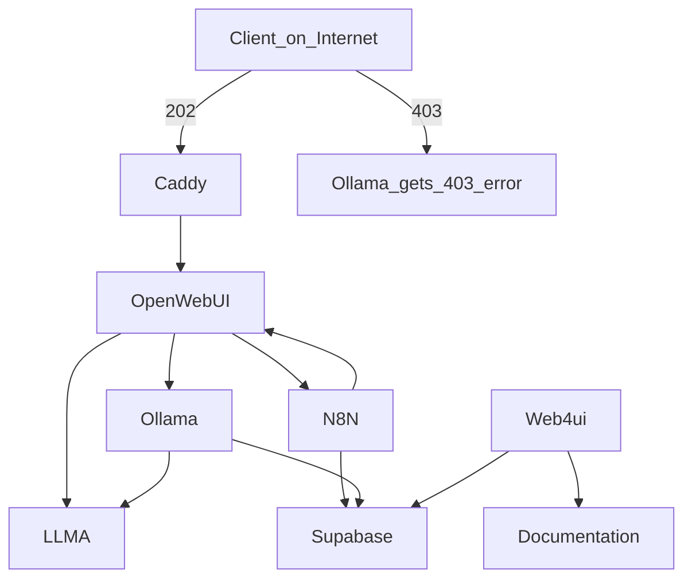

With BozTunnel V2, 

**Inspired from these sites:**
<br>
Collected over time:

> Local AI <br>
> https://www.youtube.com/watch?v=E2GIZrsDvuM<br><br>
Local AI <br>
> https://brainsteam.co.uk/2024/07/08/ditch-that-chatgpt-subscription-moving-to-pay-as-you-go-ai-usage-with-open-web-ui/ <br><br>
Cloudflare tunnels:<br>
> https://github.com/mitja/llamatunnel<br><br>
Cloudflare security login: <br>
> https://youtu.be/Q5dG8g4-Sx0?t=1164<br><br>
Docker networking <br>
> https://www.youtube.com/watch?v=bKFMS5C4CG0<br><br>
RAG <br>
> https://www.youtube.com/watch?v=_R-ff4ZMLC8


# Installation

**Prerequisites**

- **Docker Desktop**
- **Ollama** installed on your machine and running on http://ollama.local:11434 (in my case on another server)
- **A Cloudflare account.**
- **A domain mangaged with Cloudflare DNS.**
cloudflared installed on your machine. <br>You can install it with <br> macOS<br> ````brew install cloudflare/cloudflare/cloudflared````<br>Windows<br>````winget install --id Cloudflare.cloudflared````<br>For linux, use the package manager of your distribution.

"wget (https://github.com/cloudflare/cloudflared/releases/latest/download/cloudflared-linux-arm)<br>
sudo cp ./cloudflared-linux-arm /usr/local/bin/cloudflared<br>
sudo chmod +x /usr/local/bin/cloudflared<br>
cloudflared -v"

- **Python 3.8** or newer
- **Git 2.27** or newer

**Install Copier**

On Linux:
```
python3 -m pip install --user pipx
python3 -m pipx ensurepath
pipx install copier
```

Note that you probably need to start another terminal after installing ``pipx`` to make the pipx command available.

**Create a Cloudflare API Token**

Create a Cloudflare API token with the permissions to modify the DNS zone. This is needed for the Caddy DNS challenge. Go to the Cloudflare dashboard and create a token as follows:

``My Profile`` > ``API Tokens`` > ``Create Token`` > ``Edit Zone DNS`` > ``Zone:DNS:Edit`` > ``Include:Specific Zone:<DOMAIN_NAME>`` > ``Continue to Summary`` > ``Create Token``

Login with cloudflared on Your Local Machine

**On you local machine, login with cloudflared:**
````
cloudflared tunnel login
````
**Create a Folder for the Docker Stack**

If you keep all you docker stacks in a directory like $HOME/docker-stacks, you can use the following commands to create the Llama Tunnel stack in a new sub-directory.

macOS and Linux:
````
STACK_DIR="$HOME/docker-stacks/boztunnel"
mkdir -p $STACK_DIR
cd $STACK_DIR
````

**Create a Data Directory for cloudflared**

````
mkdir -p ./data/cloudflared
````

**Create a Tunnel and DNS Routes**

Create a tunnel and DNS routes for the services. cloudflared tunnel create returns a ``tunnel id``. <br>``Please note it as you will need it later.`` <br>This assumes, you keep the data directory at the default location which is ./data in the project directory. <br>If you want to change location of the data directory, you need to create the directory structure and adjust the path accordingly.

macOS and Linux:
````
TUNNEL_NAME="boztunnel"
DOMAIN_NAME="askboz.se"
API_SUBDOMAIN="minime"
APP_SUBDOMAIN="chat"
cloudflared tunnel create --credentials-file ./data/cloudflared/credentials.json $TUNNEL_NAME
cloudflared tunnel route dns $TUNNEL_NAME $API_SUBDOMAIN.$DOMAIN_NAME
cloudflared tunnel route dns $TUNNEL_NAME $APP_SUBDOMAIN.$DOMAIN_NAME
````

Note that you cannot manage this tunnel on the Cloudflare Dashboard. Instead, you need to use the cloudflared CLI tool to manage the tunnel and the DNS routing, otherwise you won't get the credentials.json file which is required to authenticate the cloudflared service.

**Change Permission**
````
chmod 755 ./data/cloudflared/credentials.json
````

**Create the Project from the Template**

Create the project from the template with copier and answer the questions. If you forgot the tunnel id, you can find it in the data/cloudflared/credentials.json file or see it with cloudflared tunnel list.
````
copier copy gh:bozman2021/boztunnel_v2 .
````

This will create a new directory in the STACK_DIR with the all the files necessary to run the tunnel.


***NEW:***

_This is built in the Docker Compose file, you ``don't`` have to create this.
For reference only._

- https://youtu.be/bKFMS5C4CG0?t=1991

````
sudo docker network create -d ipvlan \
> --subnet 192.168.2.0/24 \
> --subnet 192.168.3.0/24 \
> -o parent=enX0 -o ipvlan_mode=l3 \
> cloudl3net
````

**Start the Services**

Change into the project directory and start the services in the foreground:

````
docker compose up --build
````
_in detached mode_

````
docker compose up --build -d
````
Easy chart over dependecies.
(https://mermaid.js.org/#/)<br>



> [!IMPORTANT]
> And finally when openwebui is started dont forget to add the API Token key.


